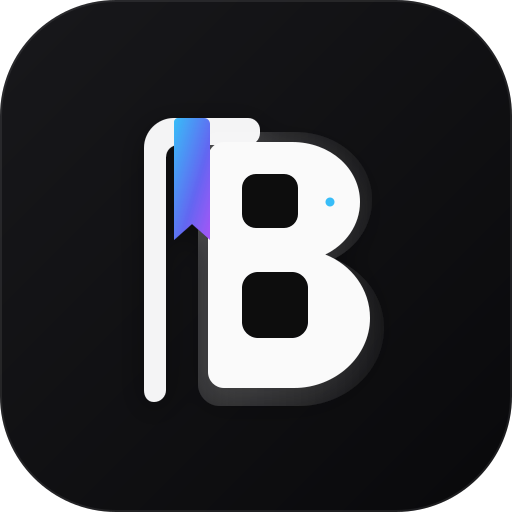
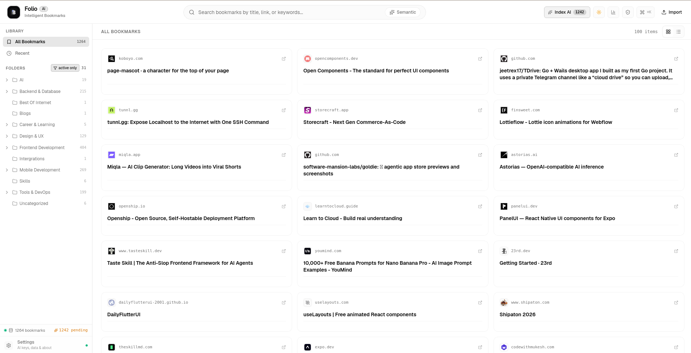

<p align="center">
  
</p>

<h1 align="center">Folio</h1>

<p align="center">
  <strong>A high-performance, privacy-first bookmark engine with local vector search and Gemini AI enrichment.</strong>
</p>

<p align="center">
  <a href="https://tauri.app/"></a>
  <a href="https://react.dev/"></a>
  <a href="https://www.typescriptlang.org/"></a>
  <a href="https://sqlite.org/"></a>
  <a href="https://orm.drizzle.team/"></a>
  <a href="https://tailwindcss.com/"></a>
  <a href="https://ai.google.dev/"></a>
  <a href="LICENSE"></a>
</p>

<p align="center">
  
</p>

---

## Overview

**Folio** is a desktop application designed to organize, enrich, and search through thousands of bookmarks without surrendering privacy. Built on **Tauri v2**, **React 19**, and an embedded **SQLite** database, Folio keeps all data locally on your device while optionally leveraging **Google Gemini** for intelligent classification, summaries, and vector embeddings.

---

## Key Features

- **Local-First & Private** — All bookmarks, folders, and vector embeddings are stored locally in SQLite via Drizzle ORM. Zero telemetry.
- **Hybrid Search** — Instant full-text keyword filtering combined with cosine-similarity vector search powered by `text-embedding-004`.
- **AI Enrichment** — Automated categorization, concise summaries, topic tags, and tech-stack detection using Gemini models with rate-limit resilient background queueing.
- **Smart Deduplication** — Canonical URL normalization that strips tracking parameters (`utm_*`, referral tokens) and identifies duplicate bookmarks for easy cleanup.
- **High-Speed Importer & Exporter** — Parses Netscape Bookmark HTML files from Chrome, Safari, Firefox, Arc, and Edge (1,500+ items in <200ms) with full hierarchy preservation and HTML export.
- **Refined UX** — Dark, light, and system themes, responsive grid/list layouts, folder tree navigation, and keyboard-first design.

---

## Tech Stack

| Layer | Technologies |
| :--- | :--- |
| **Desktop Runtime** | [Tauri v2](https://tauri.app/) (Rust backend, native OS webview) |
| **Frontend** | [React 19](https://react.dev/), [TypeScript](https://www.typescriptlang.org/), [Vite](https://vitejs.dev/) |
| **Styling & UI** | [Tailwind CSS](https://tailwindcss.com/), [Radix UI](https://www.radix-ui.com/), [Lucide Icons](https://lucide.dev/), [Sonner](https://sonner.emilkowal.ski/) |
| **State & Cache** | [TanStack Query](https://tanstack.com/query) |
| **Storage & ORM** | [SQLite](https://sqlite.org/) via `@tauri-apps/plugin-sql` & [Drizzle ORM](https://orm.drizzle.team/) |
| **AI & Embeddings** | [Google Gen AI SDK](https://github.com/google-gemini/generative-ai-js) (`@google/genai`) |

---

## Getting Started

### Prerequisites

- [Node.js](https://nodejs.org/) (v18+) and [pnpm](https://pnpm.io/)
- [Rust toolchain](https://www.rust-lang.org/tools/install) (required for building Tauri apps)

### Installation

```bash
# Clone repository
git clone https://github.com/NickM101/bookmark-engine.git
cd bookmark-engine

# Install frontend dependencies
pnpm install
```

### Development

```bash
# Run web preview only
pnpm dev

# Run desktop application with Tauri
pnpm tauri dev
```

### Production Build

```bash
# Build desktop executable and installers
pnpm tauri build
```

---

## Configuration

Folio works out-of-the-box as a local bookmark manager. To enable AI categorization and semantic search:

1. Open **Settings** (`⌘` / `Ctrl` + `,` or the settings icon in the top right).
2. Enter your **Gemini API Key** (obtainable free from [Google AI Studio](https://aistudio.google.com/)).
3. Keys are stored locally on your machine and never sent anywhere except the official Google Gemini API endpoint.

---

## Testing

```bash
pnpm test
```

---

## License

Distributed under the [MIT](LICENSE) License.
